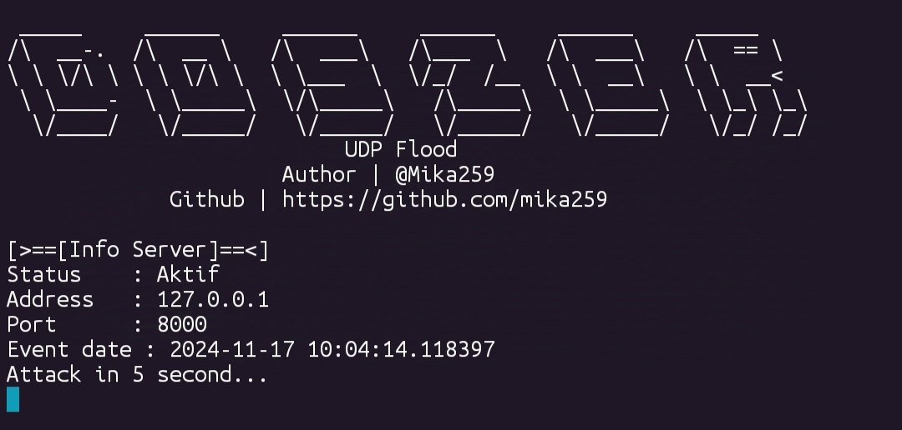
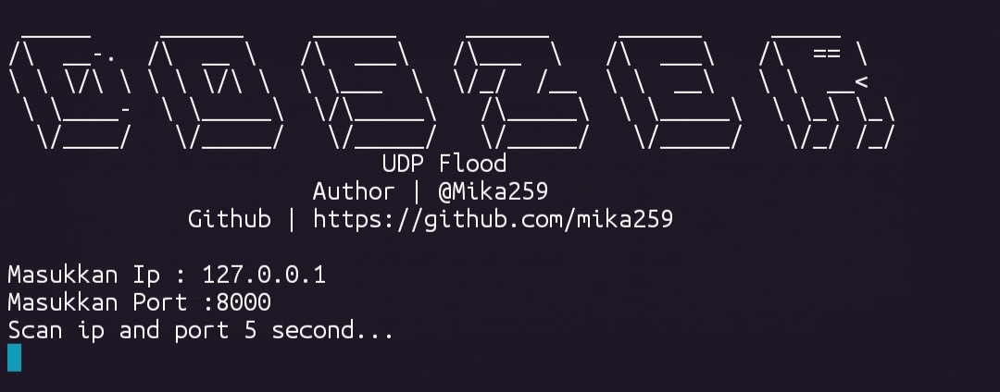

# 4Doszer tool
Ini ialah tool yang menyerang dengan menghantar Denial of Service (DOS) ke pelayan dengan mebanjiri pada port-port udp si server.

# Screenshot



# Use as Termux
- Update package, upgrade package, install git, install python.
```bash
pkg update && pkg upgrade -y && pkg install git -y && pkg install python -y
```


- Git clone tool and run
```bash
git clone https://github.com/mika259/4doszer
cd 4doszer
python doszer.py
```

- Unix-Like user mesti dah tahu cara pasang sendiri.

# Info
- Tool ini dicompile kerana saya sedang belajar dalam obfuscating scripting.
